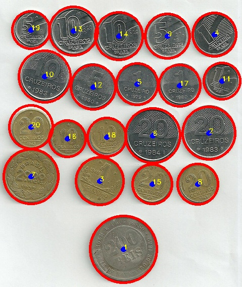

# Final Project  - 2D image processing - HSE / Coursera

This file contains instructions for the final project of the Coursera course from HSE University - 2D Image Processing.
The implementation is coded in C++.

## Used Softwares

Visual Studio 2022 + VC2017

```Linker Input additional Dependencies
opencv_core455.lib
opencv_highgui455.lib
opencv_imgcodecs455.lib
opencv_imgproc455.lib
opencv_ximgproc455.lib
```

## Usage

Images are located in `./imgs/` and named as: *coinsX.jpg*

where **X** from 1 to 10.

Once start the source code, it will request to input the picture file name.


```cpp
Images are located at imgs/ folder.
Please, type the image name: (max. 20 characters)
_
```


## Output

Once the image name is inserted, the results with detected coins will be displayed.
It will also generate a text file with the center point and radius of each detected coin, as well the image with the detected coins marks.

```cpp
Images are located at imgs/ folder.
Please, type the image name: (max. 20 characters)
coins4.jpg
The path is: imgs/coins4.jpg
Image size: [479 x 568]
image OKAY
Coins detected: 20
Circle 1 - Center point: (244,493) radius: 66
Circle 2 - Center point: (413,263) radius: 52
Circle 3 - Center point: (197,358) radius: 47
Circle 4 - Center point: (424,68) radius: 43
Circle 5 - Center point: (271,166) radius: 41
Circle 6 - Center point: (302,268) radius: 54
Circle 7 - Center point: (61,349) radius: 54
Circle 8 - Center point: (391,364) radius: 40
Circle 9 - Center point: (331,71) radius: 44
Circle 10 - Center point: (88,151) radius: 51
Circle 11 - Center point: (439,160) radius: 36
Circle 12 - Center point: (184,172) radius: 44
Circle 13 - Center point: (145,61) radius: 48
Circle 14 - Center point: (235,71) radius: 47
Circle 15 - Center point: (301,364) radius: 39
Circle 16 - Center point: (133,274) radius: 36
Circle 17 - Center point: (355,169) radius: 41
Circle 18 - Center point: (211,271) radius: 38
Circle 19 - Center point: (61,59) radius: 37
Circle 20 - Center point: (61,251) radius: 43
Please, see file: DetectedCircles_coins4.jpg for the result picture.
Please, see file: DetectedCirclesINFO_coins4.jpg.txt for detailed results.
```


<p align="center">
  
</p>


Nice dataset with [circulating Coin Sets of the World](http://worldcoingallery.com/countries/circ_sets/index.htm)


## Contributing
Pull requests are welcome. For major changes, please open an issue first to discuss what you would like to change.

Please make sure to update tests as appropriate.


Thank you! ;)
:octocat: :v:


## License

:balance_scale: [MIT](https://choosealicense.com/licenses/mit/)
